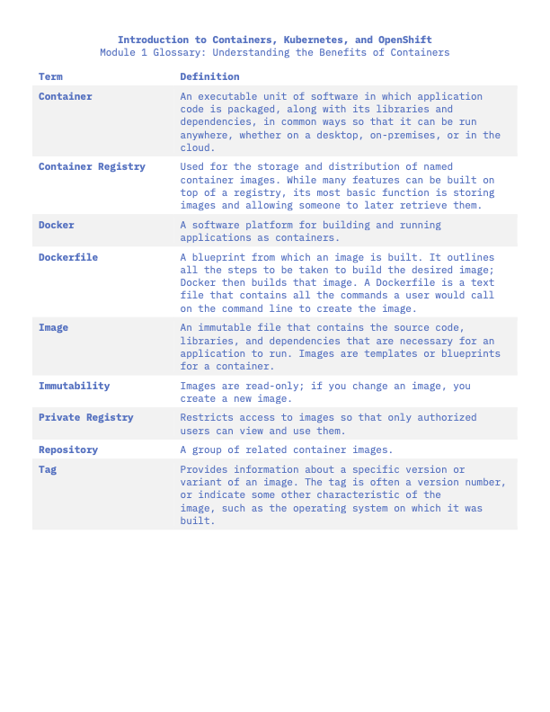
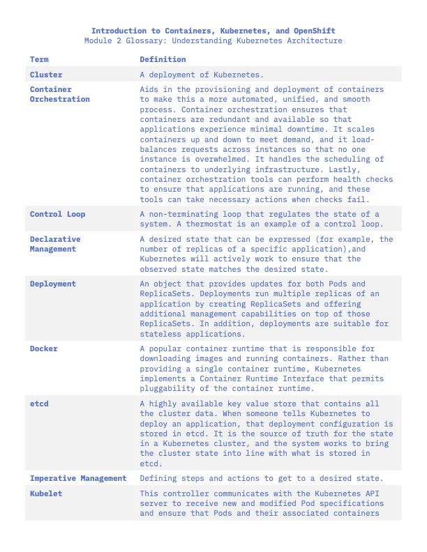

# kuberne-whatnow
Getting started with Kubernetes and Docker


# Kubernetes

## Some Kubectl basic commands 
Viewing deployments resources in a namespace
```
kubectl get deployments --namespace <namespace>
```

Describing the resources, or basically getting more information of app
```
kubectl describe deployment <app_resource> --namespace <namespace>
```

Creating a and apply settings to resource
```
kubectl apply -f <yaml file>
```

## Some more kubectl commands

Apply a configuration to a resource
```
kubectl apply
```

Displays clusters defined in the kubeconfig.
```
kubectl config get-clusters
```

Create a resource
```
kubectl create
```

Delete a resource
```
kubectl delete
```

Expose a resource to the internet as a new Kubernetes service
```
kubectl expose <deployment>/<app-name>
```

Manage the rollout of a resource
```
kubectl rollout
```

List all the pods in the namespace
```
kubectl get pods
```

Get more details about a resource such as pods using wide option
```
kubectl get pods -o wide
```

Create and runs a particular image in a pod
```
kubectl run
```

Prints the client and server version information
```
kubectl version
```

Descibe a specific pod
```
kubectl describe pod <pod-name>
```

Delete a pod
```
kubectl delete pod <pod-name>
```

List or see the exposed services that were created for a cluster
```
kubectl get services
```

Create a proxy, that will expose the cluster IP outside of the cluster
```
kubectl proxy
```

Delete a deployment and a service
```
kubectl delete deployment/<app-name> service/<app-name>
```

## Some important facts for Kubernetes

- kube-system is not a user created namespace. It is provided by the cluster

- The apply command is a declarative command, not imperative, telling kubernetes to apply the necessary changes based on the yaml file requirements


# Docker

# Some useful docker commands

Build and image from a docker file
```
docker build
```

Start the docker CLI 
```
docker CLI
```

Remove a container
```
docker container rm
```

List images
```
docker images
```

list the containers
```
docker ps
```

Pull the latest image or repo from a registry
```
docker pull
```

Push an image or a repo to a registry
```
docker push
```

Run an image base on its name in a new container, or run a command in a new container
```
docker run
```

Stop one or more running containers
```
docker stop
```

Create a tag for a target image that refers to a source image
```
docker tag
```


# Useful info





