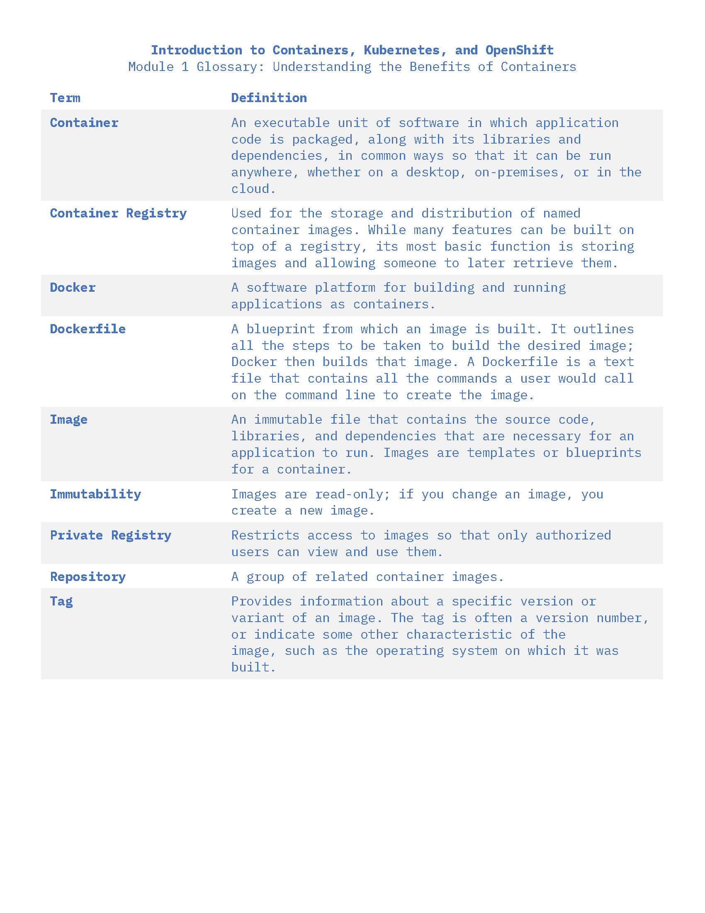
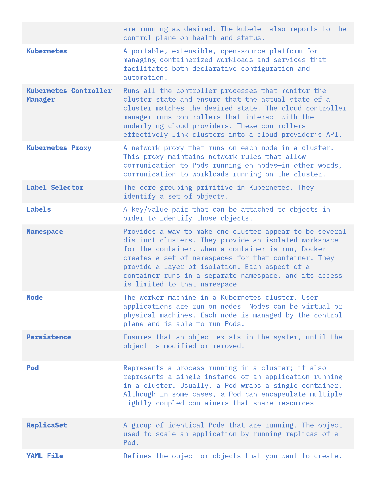
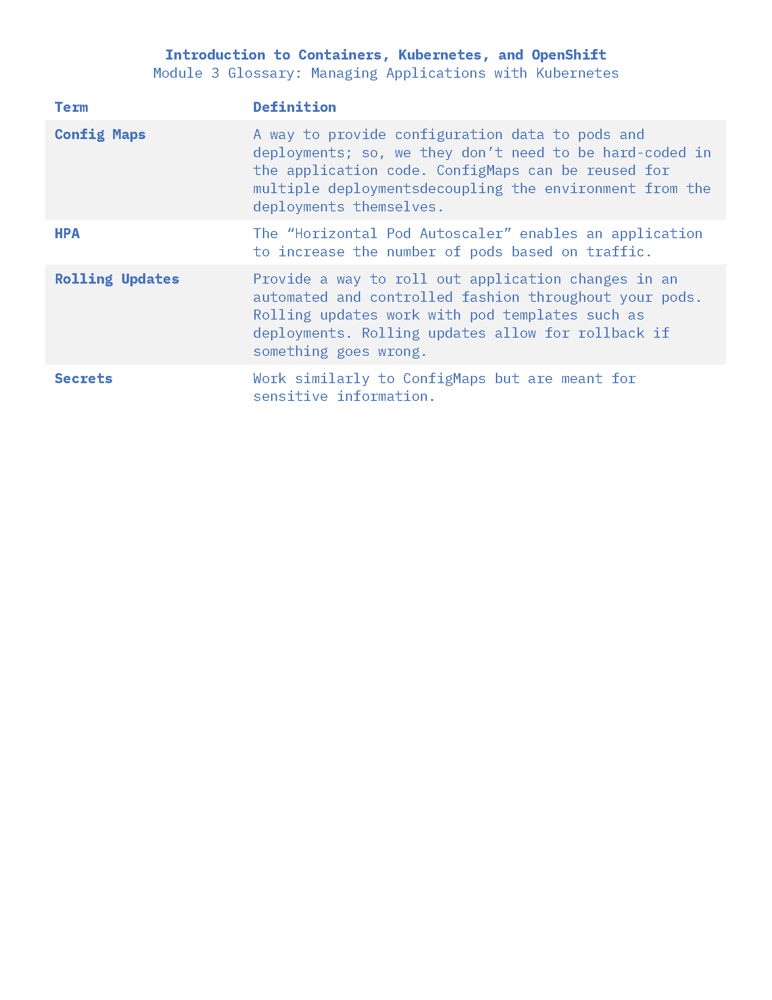
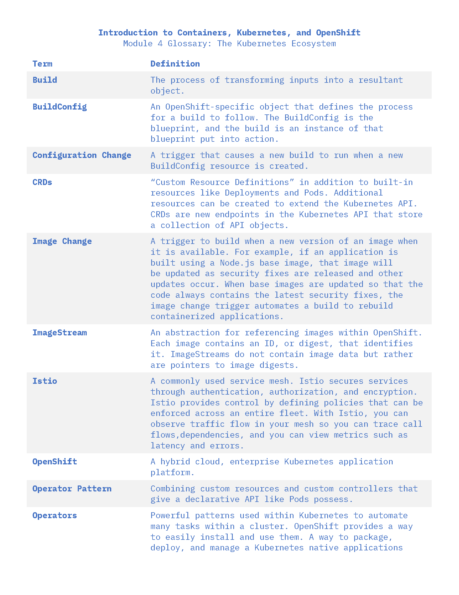
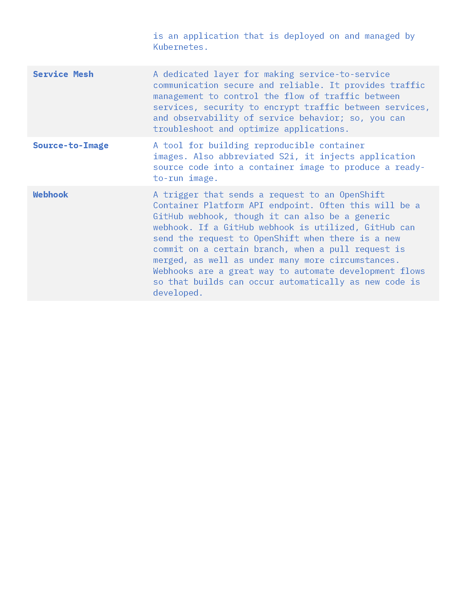

# kuberne-whatnow
Getting started with Kubernetes and Docker

### Quizlet Study Set: https://quizlet.com/_bzbtkf?x=1qqt&i=3mdcjl


# Kubernetes

## Some Kubectl basic commands 
Viewing deployments resources in a namespace
```
kubectl get deployments --namespace <namespace>
```

Describing the resources, or basically getting more information of app
```
kubectl describe deployment <app_resource> --namespace <namespace>
```

Creating a and apply settings to resource
```
kubectl apply -f <yaml file>
```

## Some more kubectl commands

Apply a configuration to a resource
```
kubectl apply
```

Displays clusters defined in the kubeconfig.
```
kubectl config get-clusters
```

Create a resource
```
kubectl create
```

Delete a resource
```
kubectl delete
```

Expose a resource to the internet as a new Kubernetes service
```
kubectl expose <deployment>/<app-name>
```

Manage the rollout of a resource
```
kubectl rollout
```

List all the pods in the namespace
```
kubectl get pods
```

Get more details about a resource such as pods using wide option
```
kubectl get pods -o wide
```

Create and runs a particular image in a pod
```
kubectl run
```

Prints the client and server version information
```
kubectl version
```

Descibe a specific pod
```
kubectl describe pod <pod-name>
```

Delete a pod
```
kubectl delete pod <pod-name>
```

List or see the exposed services that were created for a cluster
```
kubectl get services
```

Create a proxy, that will expose the cluster IP outside of the cluster
```
kubectl proxy
```

Delete a deployment and a service
```
kubectl delete deployment/<app-name> service/<app-name>
```

Scale up a deployment with a given number of replicas
```
kubectl scale deployment <deployment-name> --replicas=3
```

Update a deployment to a new image, this will trigger the rolling update
```
kubectl set image <deployment>/<deployment-name> <app-name>=<image-repo>/<namespace>/<app-name>:<tag>
```

Get the status of the rolling update
```
kubectl rollout status <deployment>/<deployment-name>
```

Undo a rollout
```
kubectl rollout undo <deployment>/<deployment-name>
```

Get wide information when getting an object info
```
kubectl get deployments -o wide
```

Create a ConfigMap that contains a new message
```
kubectl create configmap app-config --from-literal=MESSAGE="This message came from a ConfigMap!"
```

Delete a configmap (replace app-config with the configmap name)
```
kubectl delete configmap app-config
```

Delete a deployment
```
kubectl delete -f <yaml.file>
```

Delete a service
```
kubectl delete service <service-name>
```

Get secrets from a specific namespace
```
kubectl get secrets --namespace=default
```

# Open Shift

Get the oc Open Shift Version
```
oc version
```

Get pods
```
oc get pods
```

List out build configs
```
oc get buildconfigs
```

View current OpenShift project in use
```
oc project
```

Switch to a project
```
oc project <project_name>
```


Restart a deployment so containers to restart. Useful when environment variables need to be set

## Some important facts

- kube-system is not a user created namespace. It is provided by the cluster

- The apply command is a declarative command, not imperative, telling kubernetes to apply the necessary changes based on the yaml file requirements

- To push out an update, you can use rolling updates that will close down pods and spin up new ones so that there is no downtime of your application

 - ConfigMaps are used to store confi information separate from the code of an app so it won't be hardcoded. This can let certain information change without having to deploy the app
 
 - Environment variables get set at the start time of a container running. To set them again, restart the container

- Open Shift projects are Kubernetes namespaces with more admin functions.

- Open Shift includes a CLI and a web console view


# Docker

# Some useful docker commands

Build and image from a docker file
```
docker build
```

Start the docker CLI 
```
docker CLI
```

Remove a container
```
docker container rm
```

List images
```
docker images
```

list the containers
```
docker ps
```

Pull the latest image or repo from a registry
```
docker pull
```

Push an image or a repo to a registry
```
docker push
```

A good example of how to build and push a docker image
```
docker build -t <repo>/<namesapce>/<app>:<tag> . && docker push <repo>/<namespace>/<app>:<tag>
```

Run an image base on its name in a new container, or run a command in a new container
```
docker run
```

Stop one or more running containers
```
docker stop
```

Create a tag for a target image that refers to a source image
```
docker tag
```


# Useful info
Some general definitions for the road

## Docker terms


## Kubernetes Terms




## Config MAps and Secret Terms



## Open Shift Terms




## The Cloud Native Trail Map 

The steps to Cloud Native Development


